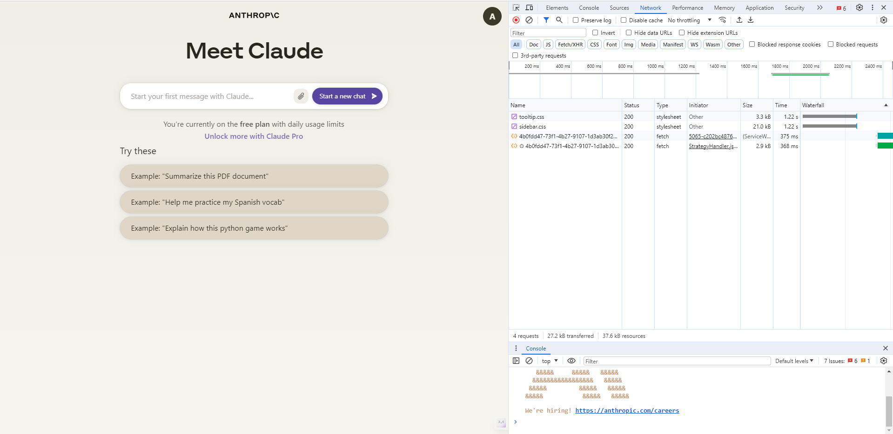
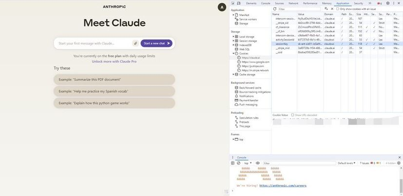

## ✨ Features

- Python
- Flask

## 💁‍♀️ How to use

- Install Python requirements `pip install -r requirements.txt`
- Add your claude session cookie to config.py
    - how to find your session cookie
    1. [Go to Claude](https://claude.ai/chats)
    2. **Press f12** 
    3. **Click application and Cookies then your can find your session cookie** 
